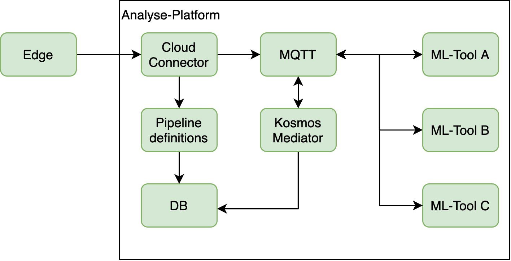

# kosmos-mediator

This project will insert received messages into a database and send a mqtt messages to the next ml-tool in the ml-pipeline

## Table of Contents

* [Overview](#overview)
* [Installation](#installation)
* [Execution](#execution)
* [Testing](#testing)
* [Configuration](#configuration)
* [Database table privileges setup & reset](#database-table-privileges-setup-and-reset)

## Overview

The main task of this project is to ensure that the pipelines of the [cloud-connector](https://github.com/kosmos-industrie40/kosmos-analyses-cloud-connector) work correctly.
The cloud-connector sends following types of update messages via MQTT:

* Sensor data, that is, the `kosmos/machine-data/<machine-id>/sensor/<sensor-id>/update` topic
* Analysis result (i.e. messages created by a pipeline step), that is, the `kosmos/analyses/<contract-id>` topic

These update messages are then handled by this project, which subscribes to the following MQTT topics:

- `kosmos/analyses/+`
- `kosmos/analyses/+/temporary`
- `kosmos/machine-data/+/sensor/+/update`
- `kosmos/machine-data/+/sensor/+/update/temporary`

If this project receives a sensor-update, it searches the pipeline corresponding to the sensor in the database and executes it (if it was found).

Analysis result messages get written into the `analysis_result` table of the database, unless the message is explicitly marked as temporary via the `"persistOutput": false` flag.
If there exists some further pipeline step, it will be executed.

Every message received by this project gets broadcast to the `kosmos/analytics/<model-url>/<model-tag>` topic,
where `<model-url>` is the url of the model with all `/`-characters replaced by `-`, and `<model-tag>` is replaced by the model tag.

The following chart shows the way [cloud-connector](https://github.com/kosmos-industrie40/kosmos-analyses-cloud-connector), this project (kosmos-mediator) and the database are integrated:



## Installation

The following describes the steps required to compile and run this project (if you already have one of the listed dependencies installed, simply skip the corresponding step).

* Install Golang 1.14.
* Install required dependencies GOLang dependencies listed in the `go.mod` file, using the standart `go mod download` command.
* Install the [PostgresSQL](https://www.postgresql.org/download/) DBMS.
* Install [Mosquitto](https://mosquitto.org/download/) - this is an implementation of the MQTT broker.
* Create a database (name it `connector` if you don't want to change the default configuration)
* Create a PostgresSQL user with all privileges for the created database. By default, the project will assume both the username and the password to be `kosmos`.
* In the created database, run the SQL query from `createDatabase.sql` - this will create the necessary tables.

## Execution

The project can be compiled with the `make` or `go build ./...` commands.

The resulting `connector` binary can be executed using
```bash
./connector -v <log-level>
```
where `<log-level>` is the logging verbosity level, that is, a number between 0 and 5 where 0 would log only
the most important information whereas 5 forces everything to be logged, including debugging information.
See [here](https://github.com/kubernetes/community/blob/master/contributors/devel/sig-instrumentation/logging.md#what-method-to-use)
for more details.

## Testing

To create a simple testing environment, run the SQL query from `test/test.sql`. This will lead to the creation of a few machines, sensors, contracts and pipeline steps in the database. 
Once you made sure that the MQTT server, the database and kosmos-mediator are all running, execute the `test.sh` bash script located in the `test` directory.
This will send messages with example payloads to various endpoints, namely to
```
kosmos/machine-data/machine/sensor/sensor/update
kosmos/machine-data/machine/sensor/sensor/update/temporary
kosmos/analyses/contract
kosmos/analyses/contract/temporary
```
Concretely, the json payloads sent to the first 2 topics are the sensor update messages.
The analysis results get published to the last 2 topics listed above.

In case you need to manually receive updates, run
```bash
mosquitto_sub -h <host> -p <port> -t 'kosmos/machine-data/machine/sensor/sensor/update'
```
where `<host>` and `<port>` are the host and port of the MQTT server, respectively.

If everything works the correct way, then the mediator should
 
* record the received messages in the database, that is, in the `analysis_result` table
* publish the received messages to the `kosmos/analytics/url/tag` topic

after running the test.

## Configuration

The configuration of the application will be made through two configuration files and command line flags. 
The configuration parameters will be explained in the next three sections.

### CLI-Flags
In this section the command line parameters will be displayed. Flags which are created by the logging tool `klog` will not be
acknowledge in this chapter.

| flag | default value | description |
|------|---------------|-------------|
| pass | examplePassword.yaml | is the path to the password configuration file |
| config | exampleConfig.yaml | is the path to the configuration file |

### Password
The password configuration contains passwords for the database connection and the mqtt connection. An example can be
found in the `examplePassword.yaml` file.

|parameter|description|
| ------- | --------- |
| mqtt.user | is the user name of the mqtt user which is used for the mqtt connection |
| mqtt.password | is the password which is used by the mqtt.user for the mqtt connection |
| database.user | is the user for the postgresql database connection |
| database.password | is the password for the postgresql database connection |

### Configuration
The configuration file will be used to configure the system without including credentials. An example configuration
can be found in the `exampleConfiguration.yaml` file.

| parameter | description |
| --------- | ----------- |
| webserver.address | is the IP address on which this application will be open the web server|
| webserver.port | is the port this application used for the web server |
| database.address | is the IP address (or URL), where the PostgreSQL server could be found |
| database.port | is the port of the PostgreSQL server |
| database.database | is the name of the PostgreSQL database |
| mqtt.address | is the IP address (or URL) of the mqtt broker |
| mqtt.port | is the port of the mqtt broker|
| mqtt.tls | enables tls of the mqtt broker |

## Database table privileges setup and reset

If you need to reset the database, that is, wipe out all the data, run
```sql
DROP SCHEMA public CASCADE;
CREATE SCHEMA public;
```

**Warning**: this will delete all tables in the database (more precisely: in the `public` schema)

Once all tables have been deleted and the `public` schema has been recreated,
run the query from `createDatabase.sql` to recreate all the tables.

After that, run
```sql
GRANT ALL ON SCHEMA public TO postgres;
GRANT ALL ON SCHEMA public TO public;
GRANT SELECT, INSERT, UPDATE, DELETE ON ALL TABLES IN SCHEMA public TO kosmos;
GRANT USAGE, SELECT ON ALL SEQUENCES IN SCHEMA public TO kosmos;
```
to grant the necessary rights for manipulating data in the created tables.
Here, `kosmos` is the username used to access the database.